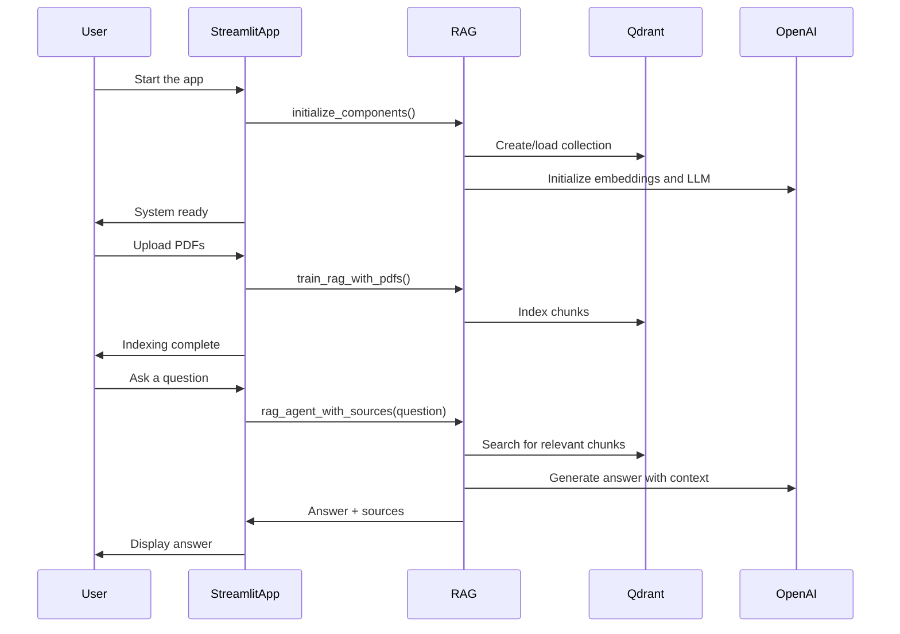

# 🏗️ Project Architecture - Simplified Explanation

## 📁 File Structure

```
├── rag.py                    # ⭐ Core system - document management and search
├── app.py                    # 🖥️ Streamlit interface
├── pipeline.py               # 🔧 Orchestration of tools (reformulation, summary, analysis)
├── utils.py                  # 🛠️ Utility functions (LLM initialization)
├── config.py                 # 🔑 API key management
├── summarizer_agent.py       # 📝 Summary agent
├── tone_analysis_agent.py    # 📊 Tone analysis agent
└── data/
    ├── qdrant_db/            # 💾 Vector database (auto-saved)
    └── *.pdf                 # 📄 Your PDF files to index
```

---

## 🔄 Workflow Overview

### 1️⃣ **Initialization** (`initialize_components()`)

- Create OpenAI embeddings (text-embedding-3-small)
- Create the LLM (GPT-4)
- Create the Qdrant client in persistent mode (auto-saved in data/qdrant_db/)
- Create/load the "rag_documents" collection
- Create the LangChain vectorstore

**Key point:** Qdrant uses `path=QDRANT_PATH` instead of `:memory:`, so everything is saved automatically!

---

### 2️⃣ **PDF Indexing** (`train_rag_with_pdfs()`)

- Load each PDF (PyPDFLoader)
- Split into chunks of 1000 characters (with 200 overlap for context)
- Convert to embeddings (1536D)
- Store in Qdrant (auto-saved in data/qdrant_db/)

**Key point:** Each chunk is transformed into a 1536-dimensional vector for semantic search.

---

### 3️⃣ **Search and Answer** (`rag_agent_with_sources()`)

- User asks a question
- Convert the question to an embedding (1536D vector)
- Search for the 5 most similar chunks in Qdrant (cosine similarity)
- Build context from the found chunks
- Send to the LLM (GPT-4): prompt + context + question
- Add source citations in Markdown format
- Final answer with sources

---

## 🕸️ Sequence Diagram (Mermaid)



---

## 🎯 Key Functions

### `initialize_components()`

- **When?** At app startup
- **What?** Prepares the whole system (LLM, embeddings, Qdrant)
- **Result?** Global variables `vectorstore`, `llm`, `embeddings` initialized

### `train_rag_with_pdfs(pdf_folder)`

- **When?** When you add new documents
- **What?** Loads, splits, vectorizes, and stores PDFs
- **Result?** Documents indexed in Qdrant (auto-saved)

### `rag_agent_with_sources(query)`

- **When?** For each user question
- **What?** Search → Context → LLM → Answer
- **Result?** Answer with source citations

### `clear_index()`

- **When?** To fully reset
- **What?** Deletes and recreates the Qdrant collection
- **Result?** Empty index

### `save_index()` / `load_index()`

- **Status:** ⚠️ Deprecated (kept for compatibility)
- **Reason:** Persistent Qdrant saves automatically

---

## 🐛 Common Issues

### "Components not initialized"

→ Click "Initialize Components" in the sidebar

### "No relevant documents found"

→ Click "Index PDFs" first

### "OPENAI_API_KEY not found"

→ Check your `.env` file

### Answers are not relevant

→ Make sure your PDFs are in the `data/` folder
→ Increase `k` in `as_retriever(search_kwargs={"k": 5})` for more context

---

## 📚 Resources

- **Qdrant:** https://qdrant.tech/documentation/
- **LangChain:** https://python.langchain.com/docs/
- **OpenAI Embeddings:** https://platform.openai.com/docs/guides/embeddings

---

## 🎓 Key Concepts

### **Embedding (vector)**

A 1536-dimensional number representing the "meaning" of a text. Similar texts have close vectors.

### **Cosine Similarity**

Measures similarity between two vectors. The closer to 1, the more similar the texts.

### **Chunk**

A piece of text of 1000 characters (with 200 overlap). Necessary because LLMs have a token limit.

### **Retriever**

Object that searches for relevant documents in the vectorstore.

### **RAG (Retrieval-Augmented Generation)**

Technique combining document search + LLM answer generation.

---

**✅ Your code is now simplified, functional, and persistent!**
