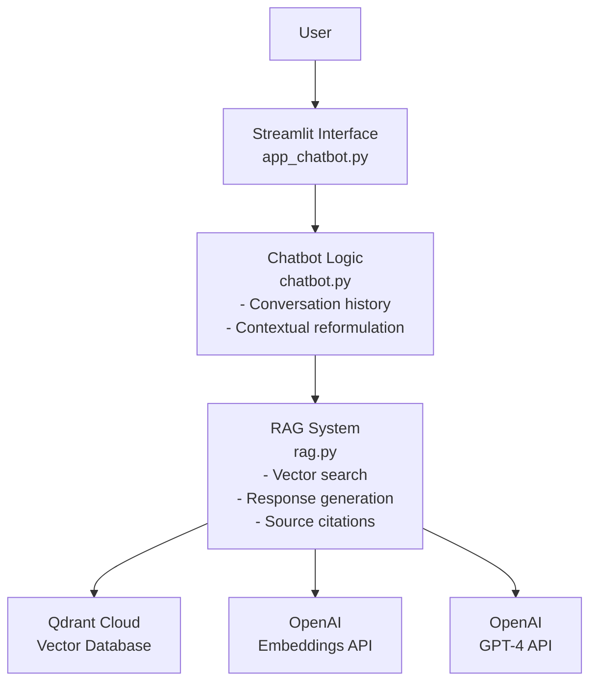
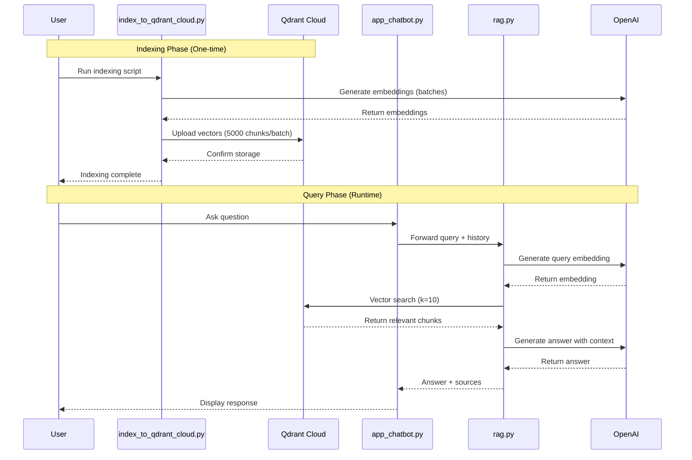

# 🏛️ LuXas - Conversational Legal Assistant with RAG

An intelligent assistant for analyzing legislative documents from the French Assemblée Nationale, based on a Retrieval-Augmented Generation (RAG) conversational system.

## Contributors

- Côme Bonneviale
- Ange Lavialle
- Aymeric Mouttapa
- Léon Pejic

## Features

- ✅ **Conversational RAG**: Understands follow-up questions (e.g., "What about children?", "Can you clarify?")
- ✅ **Anti-Hallucination**: Responds only with information from indexed documents
- ✅ **Source Citations**: Full traceability of used documents
- ✅ **ChatGPT-like Interface**: Modern interface with Streamlit
- ✅ **Scalable**: Optimized to handle 3200+ PDFs

## Architecture & Sequencing

### Architecture diagram



### Sequencing diagram



## Installation

### 1. Prerequisites

```bash
Python 3.10+
```

### 2. Clone the repository

```bash
git clone <your-repo>
cd generative-ai-final-project
```

### 3. Create a virtual environment

```sh
python -m venv venv
source venv/Scripts/activate
```

### 4. Install dependencies

```sh
pip install -r requirements.txt
```

### 5. Configuration

Create a `.env` file at the root (use `.env.example` as template):

```bash
cp .env.example .env
# Edit .env with your actual API keys
```

Required variables:

```env
OPENAI_API_KEY=sk-...
QDRANT_CLOUD_URL=https://your-cluster.gcp.cloud.qdrant.io:6333
QDRANT_API_KEY=your-qdrant-api-key
LANGFUSE_PUBLIC_KEY=pk-lf-...
LANGFUSE_SECRET_KEY=sk-lf-...
LANGFUSE_BASE_URL=https://cloud.langfuse.com
```

## Usage

### Option 1: Local Development with Streamlit

```bash
# Activate virtual environment
source venv/Scripts/activate  # Windows
# or
source venv/bin/activate      # Linux/Mac

# Launch the Streamlit app
streamlit run app_chatbot.py
```

The app will be available at **http://127.0.0.1:8501/**

### Option 2: Docker Deployment

```bash
# Build the Docker image (1min30s)
docker-compose build

# Start the container in detached mode
docker-compose up -d

# View logs
docker-compose logs -f app

# Stop the container
docker-compose down
```

The app will be available at **http://127.0.0.1:8501/**

### Indexing PDFs to Qdrant Cloud

If you need to index new PDFs to Qdrant Cloud:

```bash
# 1. Place PDFs in db_local_pdfs/

# 2. Run the cloud indexing script
python index_to_qdrant_cloud.py

# This will:
# - Process PDFs in batches (max 5000 chunks per batch)
# - Upload embeddings to Qdrant Cloud
# - Take ~30-45 minutes for 3200+ PDFs
# - Cost ~$1 in OpenAI embeddings
```

## 💬 Example Usage

### Typical Conversation

```
👤 User: What is the latest legislative proposal on child protection?

🤖 Bot: According to the document "PION5894.pdf", legislative proposal n°5894
aims to strengthen online child protection by imposing...

📚 Sources: dossier_legislatif_5894.pdf (3 chunks)

---

👤 User: What about social media specifically?

🤖 Bot: Regarding social media, Article 3 of the same proposal requires platforms
to verify users' ages...

📚 Sources: dossier_legislatif_5894.pdf (2 chunks)
```

### Out-of-Context Question (Anti-Hallucination)

```
👤 User: Who won the 2022 World Cup?

🤖 Bot: I couldn't find this information in the indexed documents.
I can only answer questions related to the provided documents.
```

## Performance with 3200+ PDFs

### Indexing (one-time)

- ⏱️ **Time**: 120 minutes
- 📦 **Result**: ~200,000 vectorized chunks
- ☁️ **Storage**: Qdrant Cloud (4GB free tier)
- 🔄 **Batching**: 5000 chunks per batch to avoid timeouts

### Usage (per question)

- ⏱️ **Response Time**: 3-8 seconds (includes cloud latency)
- 📊 **Quality**: Top 10 relevant documents
- ⏰ **Timeout**: 60 seconds for cloud operations

### Infrastructure

- ☁️ **Vector DB**: Qdrant Cloud (GCP europe-west3)
- 🐳 **Deployment**: Docker + docker-compose
- 📡 **API**: OpenAI text-embedding-3-small + GPT-4

## Project Structure

```
├── app_chatbot.py              # Streamlit interface
├── chatbot.py                  # Conversational logic with lazy loading
├── rag.py                      # Main RAG system (Qdrant Cloud client)
├── index_to_qdrant_cloud.py    # Cloud indexing script (batch upload)
├── config.py                   # API key configuration
├── requirements.txt            # Python dependencies
├── Dockerfile                  # Docker image definition
├── docker-compose.yml          # Container orchestration
├── .dockerignore
├── .env                        # Environment variables
├── .gitignore
└── load_pdfs_from_cloud.py     # retrieve pdfs from Scaleaway
```

## 🔧 Advanced Configuration

### Adjust Qdrant Cloud Timeout

In [`rag.py`](rag.py), line ~45:

```python
client = QdrantClient(
    url=QDRANT_CLOUD_URL,
    api_key=QDRANT_API_KEY,
    timeout=60  # Increase if you get timeout errors
)
```

### Adjust the Number of Retrieved Chunks

In [`rag.py`](rag.py), line ~165:

```python
retriever = vectorstore.as_retriever(search_kwargs={"k": 10})
# Reduce k=5 for faster queries, increase k=15 for more context
```

### Modify Chunk Size

In [`index_to_qdrant_cloud.py`](index_to_qdrant_cloud.py), lines 26-28:

```python
MAX_CHUNKS_PER_BATCH = 5000  # Reduce if timeout during indexing
CHUNK_SIZE = 1000            # Increase for more context per chunk
CHUNK_OVERLAP = 200          # Overlap for continuity
```

### Change the LLM Model

In [`rag.py`](rag.py), line ~43:

```python
llm = ChatOpenAI(model="gpt-4", temperature=0.1, openai_api_key=OPENAI_API_KEY)
# Options: "gpt-4", "gpt-4-turbo", "gpt-3.5-turbo"
```

## Anti-Hallucination

The system implements several protections:

1. **Strict Instructions to the LLM**: "Respond ONLY if the information is in the documents"
2. **Fallback Phrase**: "I couldn't find this information"
3. **Low Temperature** (0.1): Less creativity = fewer hallucinations
4. **Mandatory Citations**: All responses include sources
5. **Contextual Reformulation**: Ambiguous questions are clarified before search

## Future Optimizations

### 1. Reranking with Cross-Encoder

Improves the relevance of search results.

### 2. Hybrid Search (Vector + Text)

Combines semantic search and keyword matching.

### 3. Caching Frequent Queries

Reduces costs for recurring questions.

### 4. Fine-Tuning Embeddings

Improves search quality for legal domain.

---

**Created with ❤️ for analyzing legislative proposals from the French Assemblée Nationale**
