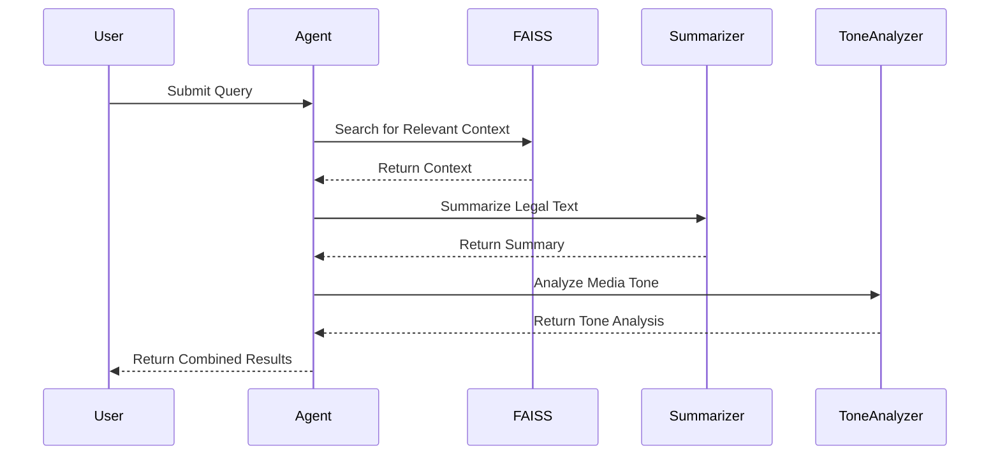
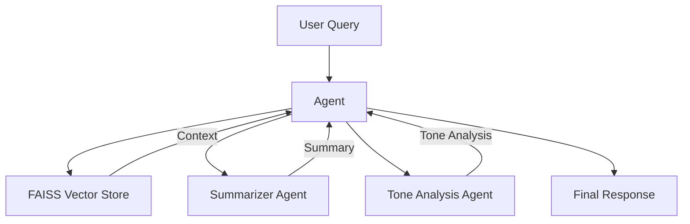

# Generative AI Final Project

## Project Description
This project is a modular pipeline designed to process legal texts, analyze media tone, and index PDF documents using advanced AI tools. The pipeline leverages LangChain, FAISS, and PyPDF2 to create a dynamic and efficient workflow. The main components include:

- **PDF Ingestion**: Extracts text and metadata from PDF files and indexes them into a FAISS vector store.
- **Vector Store Management**: Handles the loading and querying of FAISS indexes.
- **Summarization**: Summarizes legal texts into concise and understandable formats.
- **Tone Analysis**: Analyzes the tone of media coverage related to legal texts.
- **Dynamic Orchestration**: Uses LangChain's `create_agent` to dynamically orchestrate tools for user queries.

---

## Project Structure
```plaintext
├── ingestion.py          # Handles PDF ingestion and metadata extraction
├── vector.py             # Manages FAISS vector store operations
├── summarizer_agent.py   # Summarizes legal texts
├── tone_analysis_agent.py # Analyzes media tone
├── rag.py                # Handles FAISS search and context retrieval
├── pipeline.py           # Orchestrates tools dynamically using LangChain
├── llm.py                # Initializes the language model
├── requirements.txt      # Lists project dependencies
```

---

## Sequence Diagram
Below is the sequence diagram illustrating the workflow of the pipeline:



---

## Project Diagram
Below is the architecture of the project:



---

## How to Run
1. **Install Dependencies**:
   ```bash
   pip install -r requirements.txt
   ```

2. **Ingest PDF Files**:
   Place your PDF files in the `data/` directory and run:
   ```bash
   python ingestion.py
   ```

3. **Run the Pipeline**:
   Use the `pipeline.py` to process user queries dynamically:
   ```bash
   python pipeline.py
   ```

---

## Requirements
- Python 3.8+
- LangChain
- FAISS
- PyPDF2

---

## Future Improvements
- Add support for additional document formats (e.g., Word, HTML).
- Enhance the tone analysis with sentiment scoring.
- Optimize FAISS indexing for large-scale datasets.

---

## Author
Lavialle
