# 🏛️ LuXas - Conversational Legal Assistant with RAG

An intelligent assistant for analyzing legislative documents from the French National Assembly, based on a Retrieval-Augmented Generation (RAG) conversational system.

## 🎯 Features

- ✅ **Conversational RAG**: Understands follow-up questions (e.g., "What about children?", "Can you clarify?")
- ✅ **Anti-Hallucination**: Responds only with information from indexed documents
- ✅ **Source Citations**: Full traceability of used documents
- ✅ **ChatGPT-like Interface**: Modern interface with Streamlit
- ✅ **Scalable**: Optimized to handle 3200+ PDFs

## 🏗️ Architecture & Sequencing

### Architecture diagram


### Sequencing diagram

```mermaid
sequenceDiagram
    participant User
    participant index_all_pdfs.py
    participant Qdrant
    participant rag.py
    participant OpenAI_LLM

    User->>index_all_pdfs.py: Démarre l'indexation des PDF
    index_all_pdfs.py->>Qdrant: Envoie les vecteurs des PDF indexés
    Qdrant-->>index_all_pdfs.py: Confirme l'ajout des vecteurs
    index_all_pdfs.py-->>User: Indexation terminée

    User->>rag.py: Pose une question
    rag.py->>Qdrant: Recherche les documents pertinents
    Qdrant-->>rag.py: Renvoie les documents similaires
    rag.py->>OpenAI_LLM: Fournit les documents et la question
    OpenAI_LLM-->>rag.py: Renvoie une réponse générée
    rag.py-->>User: Affiche la réponse
```



## 📦 Installation

### 1. Prerequisites

```bash
Python 3.10+
```

### 2. Clone the repository

```bash
git clone <your-repo>
cd generative-ai-final-project
```

### 3. Create a virtual environment

```sh
python -m venv venv
source venv/Scripts/activate
```

### 4. Install dependencies

```sh
pip install -r requirements.txt
```

### 5. Configuration

Create a `.env` file at the root:

```env
OPENAI_API_KEY=sk-...
```

## 🚀 Usage

### Option 1: Use the 4 demo PDFs

```sh
# The PDFs are already in data/
# They are automatically indexed at rag.py startup

streamlit run app_chatbot.py
```

### Option 2: Index 3200+ PDFs

```sh
# 1. Place the PDFs in db_local_pdfs/
# 2. Run the indexing script (30-35 minutes, ~$1 cost)
python index_all_pdfs.py

# 3. Launch the interface
streamlit run app_chatbot.py
```

## 💬 Example Usage

### Typical Conversation

```
👤 User: What is the latest legislative proposal on child protection?

🤖 Bot: According to the document "PION5894.pdf", legislative proposal n°5894
aims to strengthen online child protection by imposing...

📚 Sources: PION5894.pdf (3 chunks)

---

👤 User: What about social media specifically?

🤖 Bot: Regarding social media, Article 3 of the same proposal requires platforms
to verify users' ages...

📚 Sources: PION5894.pdf (2 chunks)
```

### Out-of-Context Question (Anti-Hallucination)

```
👤 User: Who won the 2022 World Cup?

🤖 Bot: I couldn't find this information in the indexed documents.
I can only answer questions related to the provided documents.
```

## 📊 Performance with 3200+ PDFs

### Indexing (one-time)

- ⏱️ **Time**: 30-35 minutes
- 💰 **Cost**: ~$1 (OpenAI embeddings)
- 📦 **Result**: ~200,000 vectorized chunks

### Usage (per question)

- ⏱️ **Response Time**: 2-5 seconds
- 💰 **Cost**: ~$0.10 per question
- 📊 **Quality**: Top 10 relevant documents

### Storage

- 💾 **Qdrant DB**: ~2-4 GB (data/qdrant_db/)
- 📄 **PDFs**: Depends on your collection

## 🧪 Tests

### Test the Conversational System

```sh
python test_conversational.py
```

### Test the Basic RAG

```sh
python test_rag.py
```

## 📁 Project Structure

```
├── app_chatbot.py              # Streamlit interface
├── chatbot.py                  # Conversational logic
├── rag.py                      # Main RAG system
├── index_all_pdfs.py          # Massive indexing script
├── config.py                   # API key configuration
├── requirements.txt            # Dependencies
├── data/
│   ├── qdrant_db/             # Vector database (auto-generated)
│   └── *.pdf                  # Demo PDFs (4 files)
└── db_local_pdfs/             # All PDFs to index
```

## 🔧 Advanced Configuration

### Adjust the Number of Retrieved Chunks

In `rag.py`, around line ~125:

```python
retriever = vectorstore.as_retriever(search_kwargs={"k": 10})
# Increase k for more context (but higher cost)
```

### Modify Chunk Size

In `rag.py`, around line ~90 and `index_all_pdfs.py`, around line ~16:

```python
CHUNK_SIZE = 1000      # Increase for more context per chunk
CHUNK_OVERLAP = 200    # Overlap for continuity
```

### Change the LLM Model

In `rag.py`, around line ~42:

```python
llm = initialize_component("LLM", {"model": "gpt-4", "temperature": 0.1})
# Options: "gpt-4", "gpt-4-turbo", "gpt-3.5-turbo"
```

## 💰 Cost Estimation

### Initial Indexing (one-time)

- 3200+ PDFs × 10 pages × 2000 chars = ~64M characters
- Embeddings (text-embedding-3-small): $0.02/1M tokens
- **Total: ~$1**

### Monthly Usage (1000 questions)

- Input: ~6500 tokens/question × $0.01/1K tokens = $0.065
- Output: ~500 tokens/question × $0.03/1K tokens = $0.015
- **Total: ~$80/month for 1000 questions**

## 🛡️ Anti-Hallucination

The system implements several protections:

1. **Strict Instructions to the LLM**: "Respond ONLY if the information is in the documents"
2. **Fallback Phrase**: "I couldn't find this information"
3. **Low Temperature** (0.1): Less creativity = fewer hallucinations
4. **Mandatory Citations**: All responses include sources
5. **Contextual Reformulation**: Ambiguous questions are clarified before search

**Estimated Hallucination Rate: <5%**

## 📈 Future Optimizations (Optional)

### 1. Reranking with Cross-Encoder

Improves the relevance of search results.

### 2. Hybrid Search (Vector + Text)

Combines semantic search and keyword matching.

### 3. Caching Frequent Queries

Reduces costs for recurring questions.

### 4. Fine-Tuning Embeddings

Improves search quality for legal domain.

---

**Created with ❤️ for analyzing legislative proposals from the French Assemblée Nationale**
